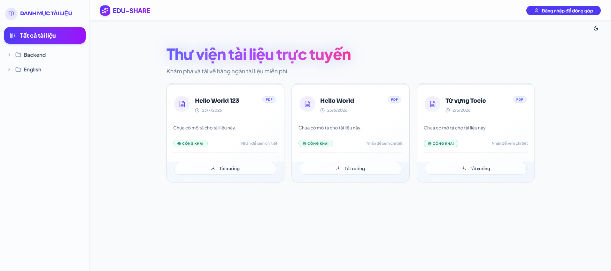
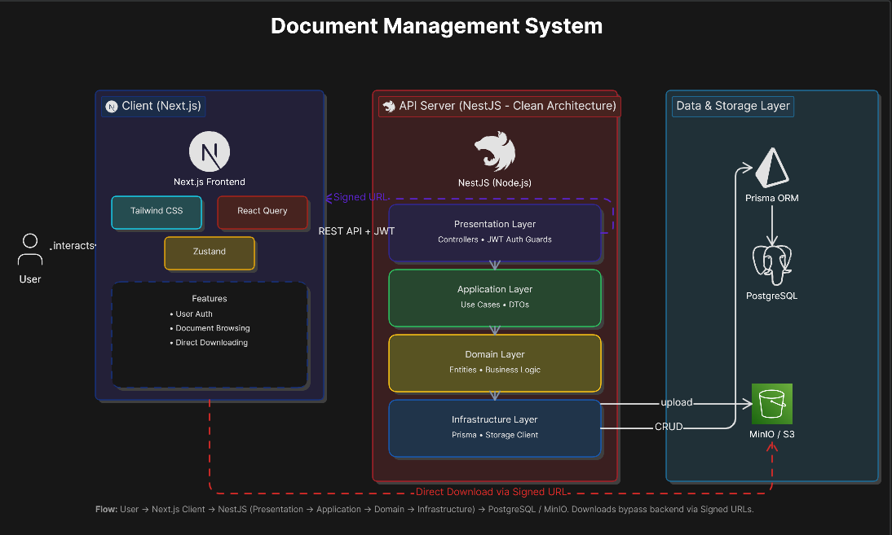
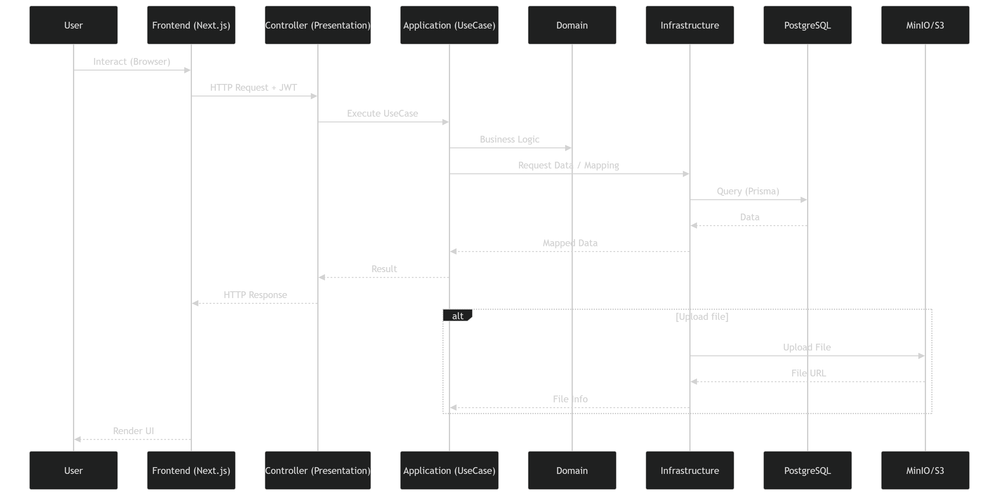
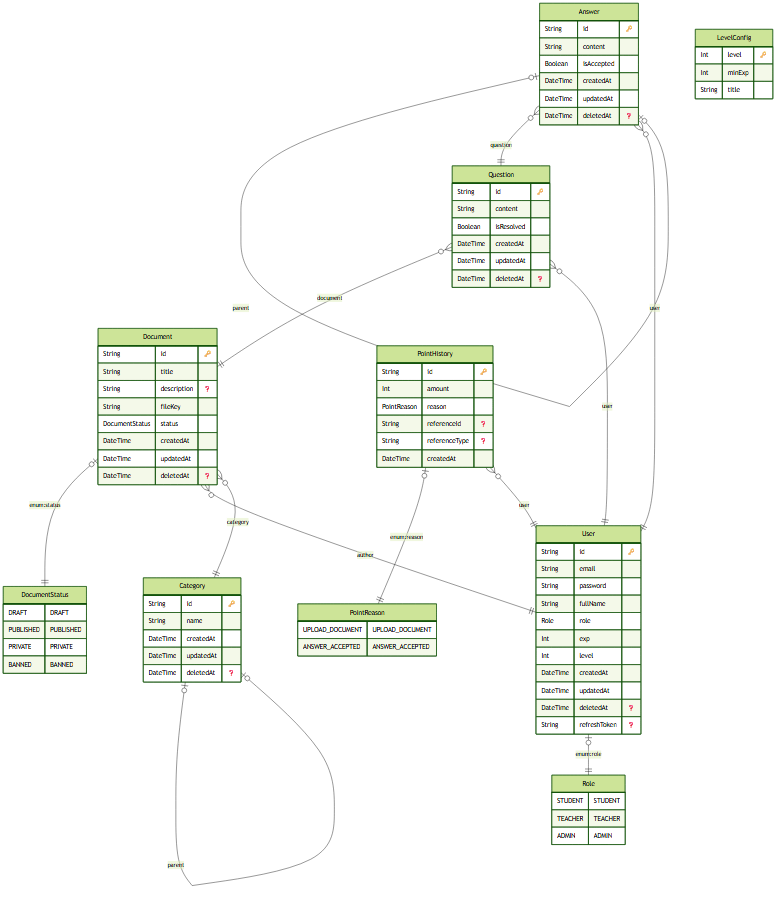

# 📑 EduShare - Document Management System

**EduShare** is a document sharing platform that allows users to upload, organize, and securely access documents through a scalable and well-structured system.

---

## 🌐 Live Demo
[lenguyen-edu-share.vercel.app ](https://lenguyen-edu-share.vercel.app/)

**Guest/Test Account:**
- **Email:** test123@gmail.com
- **Password:** 123456

## 📸 Preview
<p align="center">
  
</p>

## 🏗️ System Architecture

The project is designed following Clean Architecture and Domain-Driven Design (DDD) principles to ensure that the core business logic remains independent of external frameworks or databases.

<p align="center">
  
</p>

### 🔄 Data & Workflow: Document Upload Flow

Following Clean Architecture principles, the `UseCase` layer acts as an orchestrator, handling domain validation without depending directly on the infrastructure layer.

<p align="center">
  
</p>

### 🗄️ Database & ERD Schema

The database schema supports a recursive category system, polymorphic point history references, and a document lifecycle tracking status.

<p align="center">
  
</p>

---

## 🚀 Key Features

### 🔐 Secure Authentication
- JWT-based registration and login  
- Role-Based Access Control (RBAC)

### 🌳 Recursive Category System
- Multi-level parent-child tree structure  
- Intuitive nested document organization

### 📄 Document Management
- Upload files with metadata (Title, Description, Category)  
- Lifecycle management: `DRAFT`, `PUBLISHED`
- Access control and ownership validation  

### ⚡ Performance-Optimized Downloads
- Uses S3 Signed URLs  
- Direct client-to-storage download (reduced backend load & latency)

### 🎨 Advanced UI/UX
- Responsive dashboard with sidebar navigation  
- Tree rendering for categories  
- Zustand-based state persistence  

---

## 🛠 Tech Stack

### 🎯 Frontend
- **Framework:** Next.js 14 (App Router)  
- **State Management:** Zustand (with Persistence)  
- **Data Fetching:** TanStack Query (React Query)  
- **Styling:** Tailwind CSS + ShadcnUI  
- **Form & Validation:** React Hook Form + Zod  

### ⚙️ Backend
- **Framework:** NestJS (TypeScript)  
- **Architecture:** Clean Architecture + DDD + Modular Monolith  
- **ORM:** Prisma  
- **Database:** PostgreSQL  
- **Storage:** MinIO / AWS S3  
- **Auth:** Passport JWT & custom Guards  

---

## 🚀 Deployment Architecture

EduShare is deployed using a modern cloud-native architecture:

### 🌐 Frontend
- **Platform:** Vercel
- **Framework:** Next.js 14 (App Router)
- **Environment Variables:**
  - `NEXT_PUBLIC_API_URL` → Backend API (Render)

👉 Live: [lenguyen-edu-share.vercel.app ](https://lenguyen-edu-share.vercel.app/)

---

### ⚙️ Backend API
- **Platform:** Render
- **Framework:** NestJS (Node.js)
- **Base URL:** https://edu-share-2gnt.onrender.com/api/v1

Features:
- RESTful API
- JWT Authentication
- Role-based Access Control (RBAC)
- File upload handling via S3-compatible storage

---

### 🗄️ Database
- **Provider:** Supabase PostgreSQL
- **ORM:** Prisma

Features:
- Managed PostgreSQL database
- Auto-scaling & backups
- Prisma migrations for schema management

---

### ☁️ File Storage
- **Provider:** Supabase Storage (S3-compatible API)
- Used for:
  - Document uploads
  - Secure file access via signed URLs

Benefits:
- Direct-to-storage upload/download
- Reduced backend load
- Secure access control via signed URLs

### 🔄 System Flow (End-to-End)

1. User interacts with frontend (Vercel)
2. Frontend sends API request to backend (Render)
3. Backend validates request & processes business logic
4. Data is stored in Supabase PostgreSQL (via Prisma)
5. Files are uploaded to Supabase Storage (S3-compatible)
6. Backend returns signed URLs for secure file access

## 📂 Project Structure

### 🖥️ Frontend (Next.js)

```text
src
├── app # Next.js App Router (routing system)
│ ├── (auth) # login / register pages
│ ├── (protected) # authenticated routes
│ └── (public) # public pages
│
├── modules # feature-based architecture
│ ├── auth # authentication (login/register/logout)
│ ├── category # category tree system
│ └── document # document management (upload/list)
│
├── components/ui # reusable UI components (design system)
├── shared # shared utilities (api, hooks, types, guards)
├── providers # React providers (React Query, etc.)
└── lib # utility helpers
```

### 🧩 Backend (NestJS)
```text
src
├── main.ts
├── app.module.ts
│
├── common # shared guards, decorators, filters
├── config # app configuration
├── shared # database, logger, storage, types
│
├── modules
│ ├── auth # authentication & authorization (JWT, roles)
│ ├── category # category management (tree structure)
│ ├── document # document management (upload, publish, archive)
│ └── seed # database seeding
│
└── prisma # database layer (Prisma module & service)
```
## ⚙️ Getting Started

### 📌 Prerequisites

Before you begin, make sure you have the following installed:

- Node.js >= 18  
- Docker & Docker Compose  

---

### 🚀 Setup Instructions

#### 1. Clone the Repository

```bash
git clone https://github.com/lenguyen2005/edu-share.git
cd edu-share
```

#### 2. Environment Configuration

Create a `.env` file for both the frontend and backend:

- `/frontend/.env`
- `/backend/.env`

Use the values from `.env.example` as a reference.

#### 3. Launch Infrastructure (Database & MinIO)
```bash
docker-compose up -d
```

#### 4. Install & Run Backend
```bash
cd backend
npm install
npx prisma generate
npm run start:dev
```

#### 5. Install & Run Frontend
```bash
cd frontend
npm install
npm run dev
```

## 🚀 Future Improvements

To further enhance EduShare into a more interactive and community-driven platform, the following features are planned:

### 🎮 Gamification System (EXP & Leveling)
Introduce an experience (EXP) system where users earn points by:
- Uploading documents
- Sharing knowledge
- Engaging with the community

Users can level up based on accumulated EXP

Future extension:
- Badges & achievements
- Contribution-based ranking system

👉 Goal: Encourage active participation and reward knowledge sharing.

### 💬 In-Document Comments & Q&A
Allow users to:
- Comment directly on documents
- Ask questions related to specific content

Support threaded discussions for better context

Potential features:
- Highlight + comment on specific sections
- Upvote helpful answers

👉 Goal: Turn static documents into interactive learning resources.

### 💬 Real-time Chat System
Provide a built-in chat system for:
- Real-time collaboration

Possible extensions:
- Group chats per document or category
- Integration with document sharing context

👉 Goal: Enable deeper discussion beyond comments and improve collaboration.

## 📧 Contact

- 👨‍💻 **Developer:** Lê Bá Nguyễn  
- 📧 **Email:** [lebanguyen111@gmail.com](mailto:lebanguyen111@gmail.com)  
- 🐙 **GitHub:** [lenguyen2005](https://github.com/lenguyen2005)  