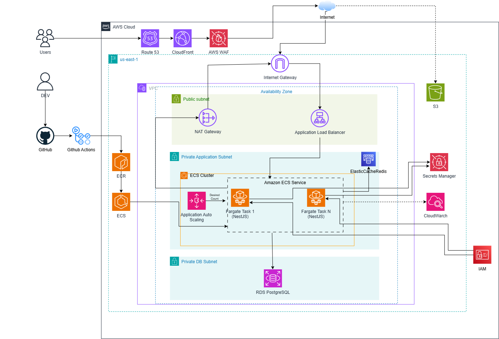

# 📑 EduShare - Document Management System

**EduShare** is a document sharing platform that allows users to upload, organize, and securely access documents through a scalable and well-structured system.

---

## 🌐 Video Demo
[Watch Demo Video](https://drive.google.com/file/d/1mKaDrhX-KlLExbmxGTlOuxx0FxYmF5m7/view?usp=sharing)
> **Note:** The AWS infrastructure (ECS, RDS, ElastiCache) has been temporarily spun down to optimize personal cloud costs. Please view the demo video for the practical workflow.

## 📸 Preview
<p align="center">
  
</p>

## 🏗️ System Architecture

The project is designed following **Clean Architecture** and **Domain-Driven Design (DDD)** principles to ensure that the core business logic remains independent of external frameworks or databases.

### ☁️ AWS Cloud Architecture
<p align="center">
  
</p>

### 🔄 Data & Workflow: Document Upload Flow
Following Clean Architecture principles, the `UseCase` layer acts as an orchestrator, handling domain validation without depending directly on the infrastructure layer.

<p align="center">
  
</p>

---

## 🚀 Key Features

### 🔐 Secure Authentication
- JWT-based registration and login  
- Role-Based Access Control (RBAC)

### 🌳 Recursive Category System
- Multi-level parent-child tree structure  
- Intuitive nested document organization

### 📄 Document Management
- Upload files with metadata (Title, Description, Category)  
- Lifecycle management: `DRAFT`, `PUBLISHED`
- Access control and ownership validation  

### ⚡ Performance-Optimized Downloads
- Uses S3 Signed URLs  
- Direct client-to-storage download (reduced backend load & latency)

### 🎮 Gamification & User Interaction
- Activity tracking and point/reward mechanisms to encourage active participation
- Interactive comment system for document discussions and Q&A

### 🎨 Advanced UI/UX
- Responsive dashboard with sidebar navigation  
- Tree rendering for categories  
- Zustand-based state persistence  

---

## 🛠 Tech Stack

### 🎯 Frontend
- **Framework:** Next.js 14 (App Router)
- **State Management & Data Fetching:** Zustand, TanStack Query
- **Styling:** Tailwind CSS
- **Form & Validation:** Zod

### ⚙️ Backend
- **Framework:** NestJS (TypeScript), Node.js
- **Architecture:** Clean Architecture, Domain-Driven Design (DDD)
- **Database & ORM:** PostgreSQL, Prisma
- **Caching:** Redis

### ☁️ Cloud & DevOps
- **Infrastructure:** AWS (ECS Fargate, ECR, RDS, S3, ElastiCache, CloudFront, WAF)
- **Containerization & CI/CD:** Docker, GitHub Actions

---

## 🚀 Deployment Architecture & CI/CD

EduShare is deployed using a highly scalable and modern cloud-native architecture on AWS.

### 🔄 CI/CD Pipeline
- **Automated Workflows:** Configured via GitHub Actions.
- **Containerization:** Source code is built into Docker images and pushed to **Amazon ECR**.
- **Deployment:** Automated rollouts to **Amazon ECS with AWS Fargate**.

### ☁️ AWS Infrastructure Overview
- **Compute & Networking:** Deployed within an AWS VPC using an Application Load Balancer (ALB) and ECS Auto Scaling to handle dynamic workloads.
- **Database & Caching:** **Amazon RDS** (PostgreSQL) for relational data and **Amazon ElastiCache** (Redis) for high-performance caching.
- **Storage & Delivery:** **Amazon S3** is utilized for storing documents, generating Signed URLs for direct client upload/download. **CloudFront** is used as the CDN.
- **Security & Monitoring:** Protected by **AWS WAF**, configuration handled via **Secrets Manager**, and system observability maintained through **CloudWatch**.

## 📂 Project Structure

### 🖥️ Frontend (Next.js)

```text
src
├── app # Next.js App Router (routing system)
│ ├── (auth) # login / register pages
│ ├── (protected) # authenticated routes
│ └── (public) # public pages
│
├── modules # feature-based architecture
│ ├── auth # authentication (login/register/logout)
│ ├── category # category tree system
│ ├── comment # document comments
│ └── document # document management (upload/list)
│
├── components/ui # reusable UI components (design system)
├── shared # shared utilities (api, hooks, types, guards)
├── providers # React providers (React Query, etc.)
└── lib # utility helpers
```

### 🧩 Backend (NestJS)
```text
src
├── main.ts
├── app.module.ts
│
├── common # shared guards, decorators, filters
├── config # app configuration
├── shared # database, logger, storage, types
│
├── modules
│ ├── auth # authentication & authorization (JWT, roles)
│ ├── category # category management (tree structure)
│ ├── document # document management (upload, publish, archive)
│ └── seed # database seeding
│
└── prisma # database layer (Prisma module & service)
```
## ⚙️ Getting Started

### 📌 Prerequisites

Before you begin, make sure you have the following installed:

- Node.js >= 18  
- Docker & Docker Compose  

---

### 🚀 Setup Instructions

#### 1. Clone the Repository

```bash
git clone https://github.com/lenguyen2005/edu-share.git
cd edu-share
```

#### 2. Environment Configuration

Create a `.env` file for both the frontend and backend:

- `/frontend/.env`
- `/backend/.env`

Use the values from `.env.example` as a reference.

#### 3. Launch Local Infrastructure (Database & Local S3-compatible Storage)
```bash
docker-compose up -d
```

#### 4. Install & Run Backend
```bash
cd backend
npm install
npx prisma generate
npm run start:dev
```

#### 5. Install & Run Frontend
```bash
cd frontend
npm install
npm run dev
```

## 🚀 Future Improvements

### 💬 Real-time Chat System
Provide a built-in chat system for:
- Real-time collaboration
- Group chats per document or category

👉 Goal: Enable deeper discussion beyond comments and improve collaboration.

## 📧 Contact

- 👨‍💻 **Developer:** Lê Bá Nguyễn  
- 📧 **Email:** [lebanguyen111@gmail.com](mailto:lebanguyen111@gmail.com)  
- 🐙 **GitHub:** [lenguyen2005](https://github.com/lenguyen2005)  